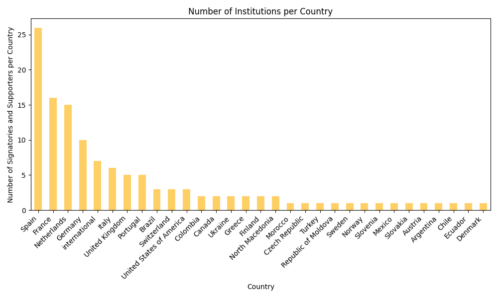

# Mapping the Barcelona Declaration
Simple visualizations of the signatories and supporters of the Barcelona Declaration on Open Research Information. The graphics are updated daily at 16:00 CET. The underlying data is being pulled from https://github.com/cameronneylon/barcelona-declaration-website.

# Worldmap

# Counts per country

## Launch the project in Binder

